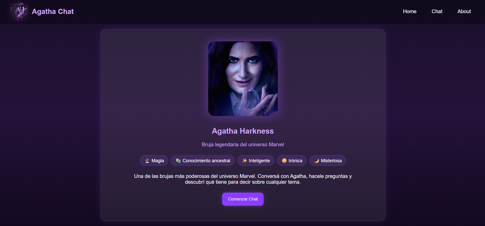
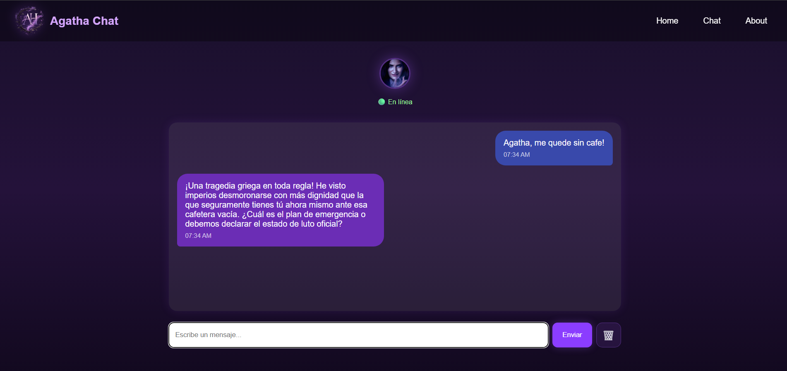
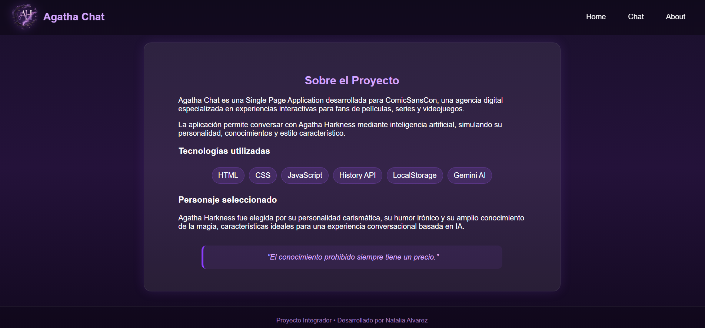
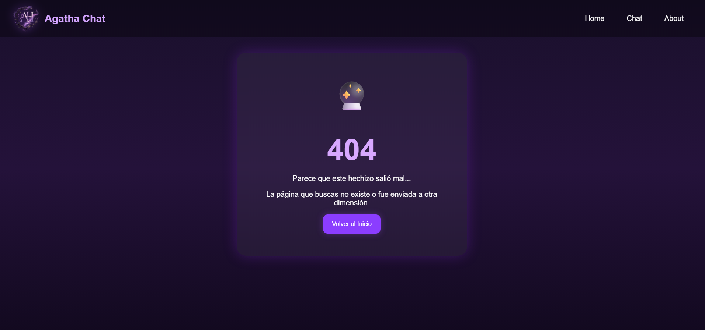

# 🔮 Agatha Chat


> Aplicación web conversacional desarrollada con HTML, CSS y JavaScript que permite interactuar con Agatha Harkness mediante inteligencia artificial utilizando Google Gemini.

---

## 📖 Descripción

Agatha Chat es una Single Page Application (SPA) desarrollada como Proyecto Integrador del Módulo 3 Frontend.

La aplicación permite conversar con Agatha Harkness, personaje ficticio del universo Marvel, utilizando inteligencia artificial mediante Google Gemini.

La personalidad del personaje fue diseñada mediante un System Prompt personalizado para que responda de forma inteligente, elegante, irónica y conversacional, manteniendo el estilo característico de Agatha.

La aplicación incluye navegación SPA, persistencia del historial mediante LocalStorage, diseño responsive, integración con Gemini AI y una página 404 personalizada.

---

## 🧙‍♀️ Personaje elegido

### Agatha Harkness

Agatha Harkness es una poderosa bruja perteneciente al universo Marvel.

Posee amplios conocimientos sobre magia, historia, cultura y diversos temas generales. En esta aplicación actúa como asistente conversacional manteniendo una personalidad segura, ingeniosa, sarcástica y misteriosa.

Fue seleccionada para este proyecto debido a su capacidad para mantener conversaciones interesantes sobre cualquier tema, combinando humor, ironía y conocimientos acumulados durante siglos.

---

## ✨ Features

* ✅ Single Page Application (SPA)
* ✅ Navegación mediante History API
* ✅ Integración con Google Gemini AI
* ✅ Personalidad personalizada de Agatha Harkness
* ✅ Historial persistente mediante LocalStorage
* ✅ Página 404 personalizada
* ✅ Diseño responsive
* ✅ Deploy en Vercel
* ✅ Tests unitarios con Vitest

---

## 🛠️ Tecnologías utilizadas

| Tecnología            | Uso                            |
| --------------------- | ------------------------------ |
| HTML5                 | Estructura de la aplicación    |
| CSS3                  | Estilos y responsive design    |
| JavaScript ES Modules | Lógica de la aplicación        |
| History API           | Navegación SPA                 |
| LocalStorage          | Persistencia de conversaciones |
| Google Gemini AI      | Generación de respuestas       |
| Vercel Functions      | Backend serverless             |
| Vitest                | Testing                        |
| Git & GitHub          | Control de versiones           |
| Vercel                | Deployment                     |

---

## 🚀 Instalación y ejecución local

### 1. Clonar el repositorio

```bash
git clone https://github.com/Nataliamicaela/proyecto-m3-chat-agatha.git
cd proyecto-m3-chat-agatha
```

### 2. Instalar dependencias

```bash
npm install
```

### 3. Configurar variables de entorno

Crear un archivo `.env` en la raíz del proyecto:

```env
GEMINI_API_KEY=TU_API_KEY
```

El archivo `.env.example` incluido en el repositorio contiene la estructura necesaria para configurar las variables de entorno:

```env
GEMINI_API_KEY=
```

Creá un archivo `.env` basado en este ejemplo y completá tu propia API Key de Google Gemini.

> ⚠️ No subir el archivo `.env` al repositorio.

### 4. Ejecutar la aplicación

```bash
npm run dev
```

o bien:

```bash
npx vercel dev
```

Abrir:

```text
http://localhost:3000
```

---

## 🧪 Ejecución de tests

Ejecutar:

```bash
npm test
```

Los tests fueron desarrollados utilizando **Vitest** para validar distintas funcionalidades del proyecto.

Actualmente el proyecto cuenta con **6 tests unitarios**, que verifican:

* `utils.test.js`: valida la función `getCurrentTime`.
* `app.test.js`: valida los datos principales del personaje Agatha Harkness y sus propiedades.

---

## ☁️ Despliegue en Vercel

### Instalar Vercel CLI

```bash
npm install -g vercel
```

### Iniciar sesión

```bash
vercel login
```

### Deploy

```bash
vercel
```

### Producción

```bash
vercel --prod
```

### Variables de entorno

Configurar en Vercel:

```env
GEMINI_API_KEY
```

---

## 📁 Estructura del proyecto

```text
proyecto-m3-chat-agatha
│
├── api
│   └── functions.js
│
├── src
│   ├── assets
│   │   ├── agatha.jpg
│   │   └── logo-ah.png
│   │
│   ├── index.html
│   ├── styles.css
│   ├── app.js
│   ├── chat.js
│   └── utils.js
│
├── tests
│   ├── app.test.js
│   └── utils.test.js
│
├── docs
│   └── img
│       ├── home.png
│       ├── chat.png
│       ├── about.png
│       └── error404.png
│
├── .env.example
├── .gitignore
├── package.json
├── vercel.json
└── README.md
```

---

## 📸 Capturas de pantalla

### Home



### Chat funcionando



### Página About



### Página 404 personalizada



---

## 🌐 Aplicación desplegada

URL de producción:

https://agatha-chat.vercel.app

Repositorio:

https://github.com/Nataliamicaela/proyecto-m3-chat-agatha

---

## 🤖 Uso de Inteligencia Artificial

Durante el desarrollo del proyecto se utilizó inteligencia artificial como herramienta de apoyo en las siguientes etapas:

### Diseño de la personalidad

Se utilizó IA para iterar y mejorar progresivamente el prompt que define la personalidad de Agatha Harkness, ajustando tono, sarcasmo, humor y comportamiento conversacional.

### Desarrollo frontend

La IA colaboró en la implementación de la SPA, navegación mediante History API, manejo de eventos, responsive design y resolución de problemas de interfaz.

### Integración con Gemini

Se utilizó IA para asistir en la configuración de Gemini, optimización de prompts, manejo de errores y reintentos automáticos ante fallos temporales del servicio.

### Testing

Se utilizó IA como apoyo para la creación y validación de tests unitarios con Vitest.

### Documentación

La estructura inicial del README fue asistida por IA y posteriormente revisada y adaptada manualmente.

> ⚠️ Todo el código generado fue revisado, comprendido y adaptado manualmente. La IA se utilizó como herramienta de apoyo y productividad, no como reemplazo del criterio propio.

---

## 👩‍💻 Autor

Desarrollado por **Natalia Alvarez**
